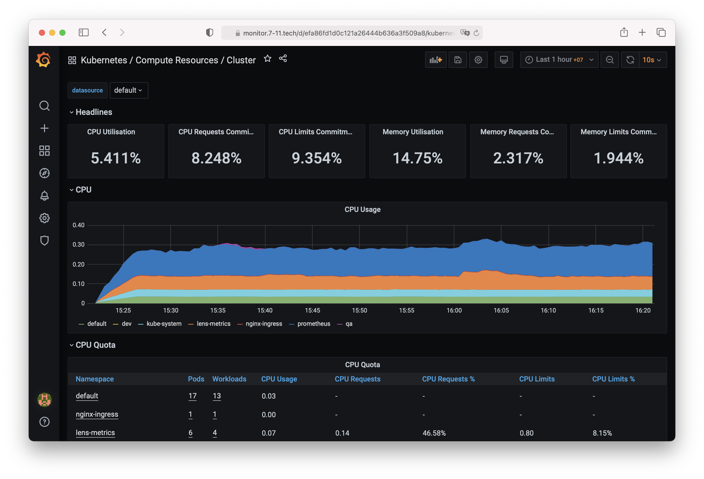

# k8s-prometheus-grafana



# 0. Create prometheus Namespace
```
kubectl create namespace prometheus
```

# 1. Add Helm repos
```
helm repo add prometheus-community https://prometheus-community.github.io/helm-charts
helm repo add stable https://kubernetes-charts.storage.googleapis.com/
helm repo update
```

# 2. Install Chart
```
helm install prometheus prometheus-community/kube-prometheus-stack -n prometheus
```

# 3. Create Ingress
```
cat <<EOF | kubectl apply -f -
apiVersion: extensions/v1beta1
kind: Ingress
metadata:
  name: prometheus-grafana
  namespace: prometheus
  annotations:
    kubernetes.io/ingress.class: nginx
spec:
  rules:
    - host: monitor.7-11.tech
      http:
        paths:
          - backend:
              serviceName: prometheus-grafana
              servicePort: 80
EOF
```

# Default Grafana Password
```
admin-user: admin
admin-password: prom-operator
```